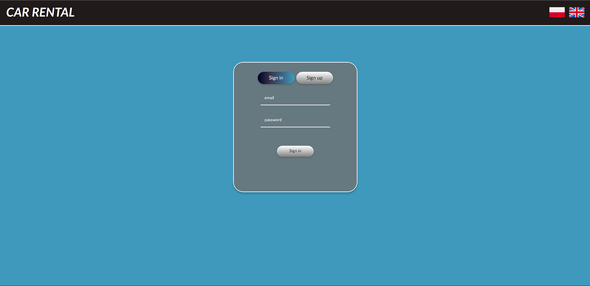
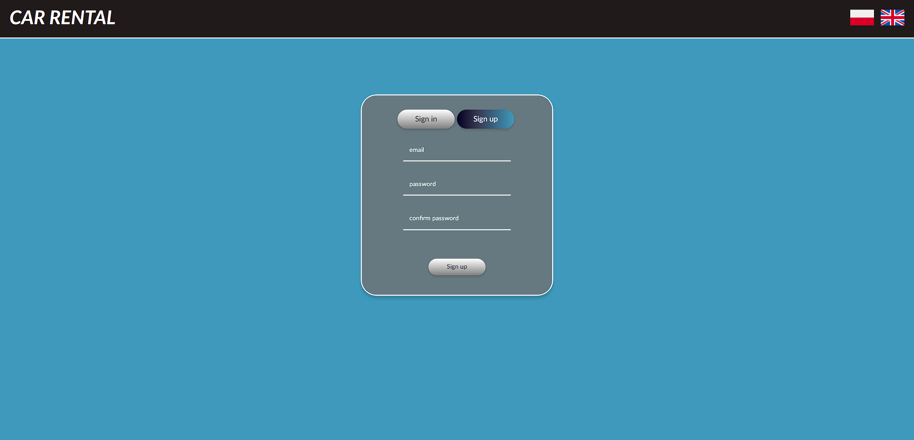
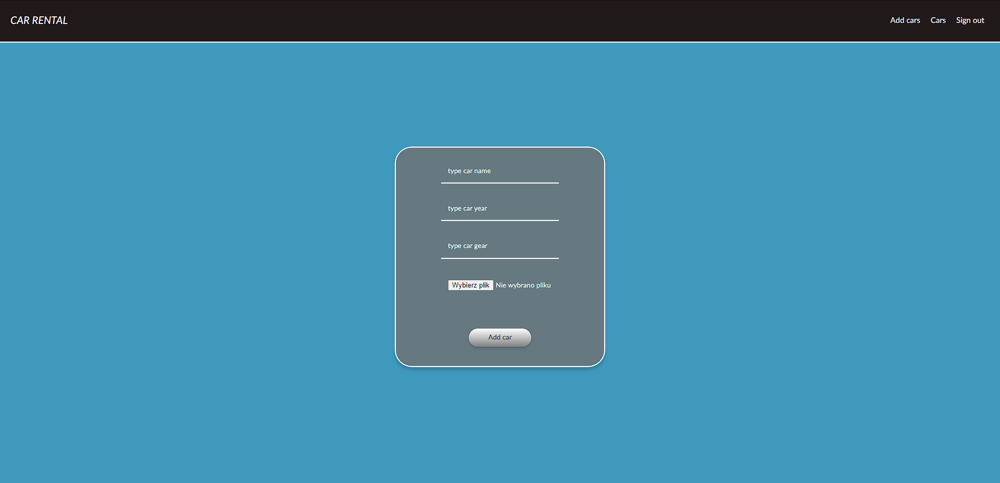
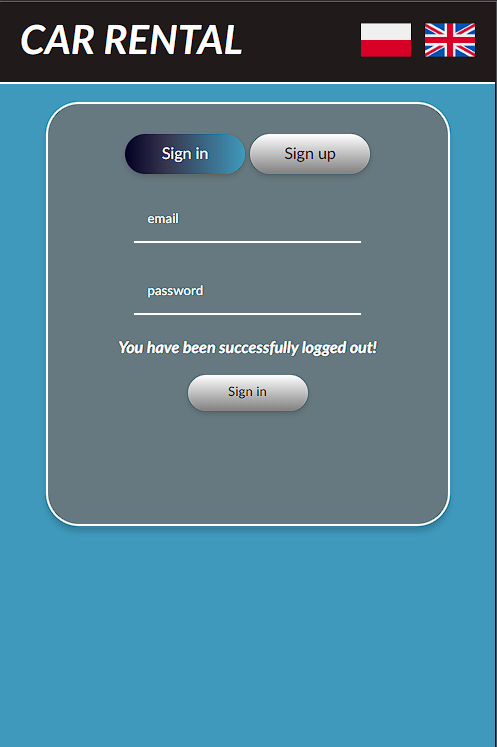

# Car Rental - WdPAI project
> Car rental application is for renting cars website.
> Check this app [click this](http://car-rental-wdpai.herokuapp.com).> 

## Table of Contents
* [General Info](#general-information)
* [Technologies Used](#technologies-used)
* [Features](#features)<!-- * [Screenshots](#screenshots) -->
* [Screenshots](#screenshots)
* [Contact](#contact)

## General Information
- I created this application for subject on studies.
- In this app you can rent car or add car if u have admin permissions.

## Technologies Used
- Docker
- NGNIX - version 1.17.8-alpine
- PHP - version 7.4.3-fpm-alpine3.11
- CodeceptJS

## Features
- Application can display a login and register pages
- Routing is working
- Available view for desktop and mobile
- Login and register work
- Adding cars work
- Display cars work
- Renting cars work
- Database attach
- Session work
- Site access is limited by permissions

## Screenshots

> Web and mobile views

## Contact
Piotr Zych <piotr.zych@student.pk.edu.pl>